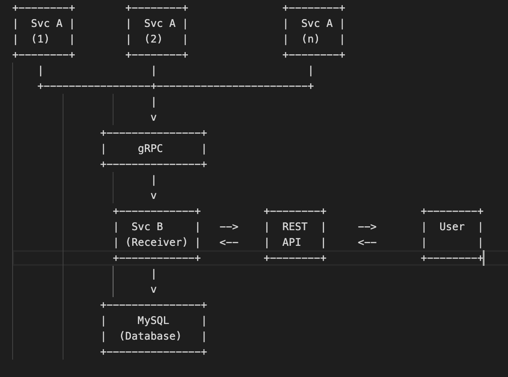

# Sensor Data Management System

## Overview

This project is a microservice-based backend system for managing sensor data using Go, Echo, MySQL, and Docker.

## Features

1. Service A to generate sensor data.
2. Service B to receive, process, and store data.
3. REST API for data management.
4. Dynamic data generation frequency.
5. Data retrieval (with pagination), deletion, and update with filtering.
6. Authentication and authorization mechanisms.
7. Scalable architecture with Docker.

## Getting Started

1. Clone the repository.
2. Run `docker-compose up --build` to start the services.
3. Access the APIs using the provided Postman collection.

## API Documentation

Swagger documentation is available at `http://localhost:8082/swagger/index.html`.
## Architecture Diagram

## ERD

